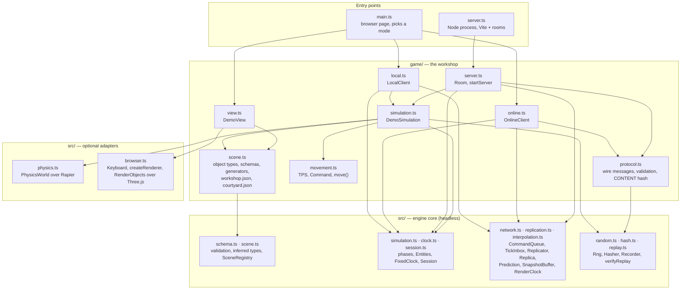
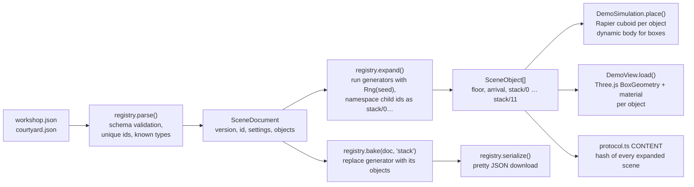
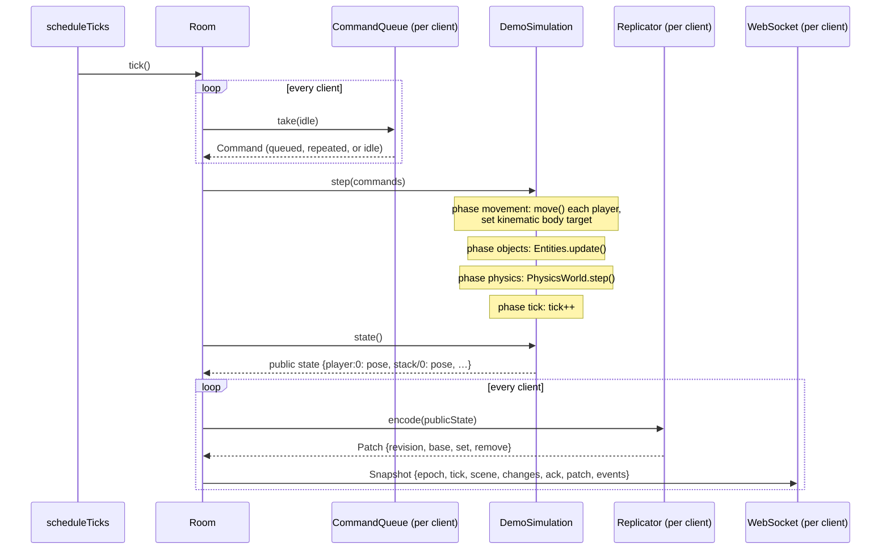
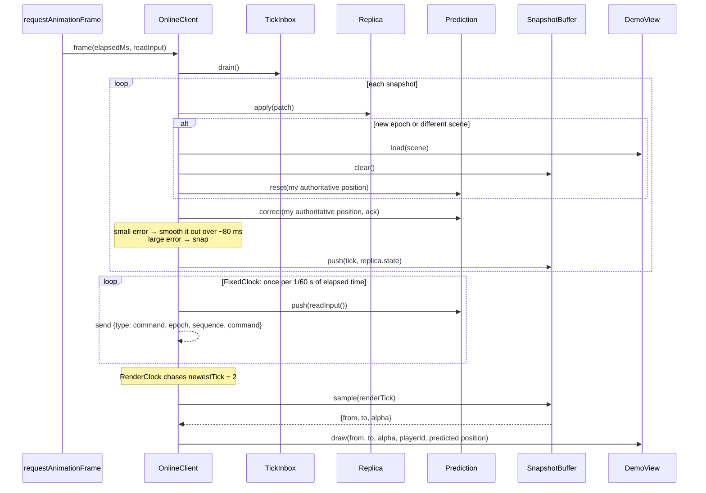
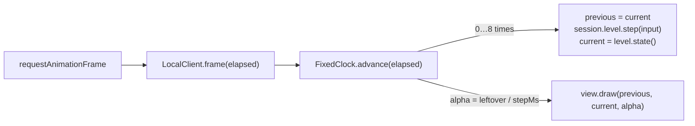
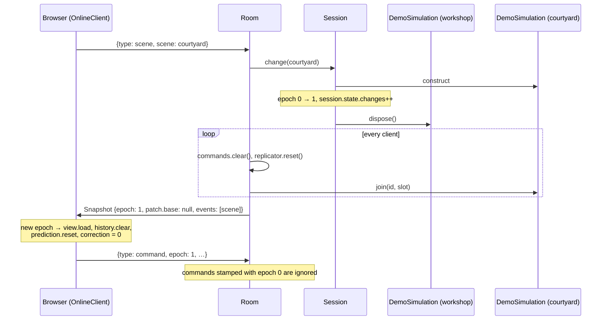
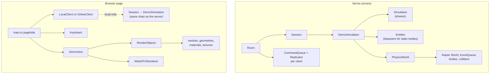
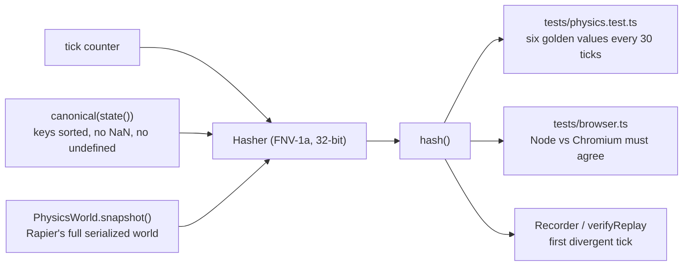

# How the engine works

This is the guided tour. It explains what runs where, what happens in one tick and one frame, and who owns what. Read it before the contract details in [README.md](README.md). The diagrams are Mermaid; GitHub and the VS Code Markdown preview render them.

## The short version

- `src/` is the **engine**: small headless primitives with no opinion about your game. The root entry point imports no DOM, Rapier, Three.js or Node API. `src/physics.ts` (Rapier) and `src/browser.ts` (Three.js, input) are optional adapters.
- `game/` is the **workshop**: one small game built on those primitives. It owns the rules, the scene content, the public state shape and the wire protocol.
- `main.ts` and `server.ts` are the **entry points**. `main.ts` runs in the browser and picks a mode from the URL. `server.ts` runs in Node and hosts rooms.

The same `DemoSimulation` runs in the browser (local mode) and on the server (online mode). Only the plumbing around it differs.

## Layer map

Rules the arrows follow:

- Nothing in `src/` imports `game/`.
- `src/index.ts` never imports `physics.ts` or `browser.ts`. A consumer opts in with `@sneakpeak/engine/physics` or `@sneakpeak/engine/browser`.
- Preview mode never loads physics. `main.ts` imports `game/local.ts` dynamically so the Rapier bundle only downloads in local mode.

## Where the old prototype's ideas went

If you know the `engine/` folder on `main`, this is the translation table.

| On `main`                                                        | Here                                                                                                                                    | Why it moved                                                                               |
| ---------------------------------------------------------------- | --------------------------------------------------------------------------------------------------------------------------------------- | ------------------------------------------------------------------------------------------ |
| `GameObject` subclass per thing, with `start/update/onCollition` | A `SceneObject` (id, type, settings) in JSON. `DemoSimulation.place()` builds physics from it, `DemoView.load()` builds meshes from it. | Content is data, so it can be validated, previewed, baked and diffed without running code. |
| `Scene` = list of classes and positions                          | `SceneDocument` JSON validated by `SceneRegistry` against per-type schemas                                                              | Same reason; also enables the `CONTENT` fingerprint check at join.                         |
| `Simulation` with `setInterval` and variable `deltaTime`         | `FixedClock` + `scheduleTicks` drive a fixed 60 Hz tick. `Simulation` runs named phases in order.                                       | Determinism. Same inputs give the same hashes on Node and Chromium.                        |
| Global `nextId` counter                                          | Authored ids from the scene; `Entities` counts runtime ids per collection                                                               | Ids no longer depend on construction order.                                                |
| `Input` sends raw key names to the server                        | `Keyboard` reads keys, `readInput()` turns them into a validated `Command { x, z }`                                                     | The server validates intent, not keyboard layout.                                          |
| `Renderer.draw()` called from the socket callback                | `OnlineClient` buffers snapshots and draws every animation frame with interpolation                                                     | Rendering no longer stutters with packet timing.                                           |
| `net.ts` with local, remote and relay modes                      | `LocalClient`, `OnlineClient`, and the `Room` server. Relay mode is gone.                                                               | A background tab cannot host an authoritative simulation.                                  |
| `Client` + `View`                                                | `DemoView` (scene graph) + `RenderObjects` (GPU resource ownership)                                                                     | Scene changes free GPU memory; the browser test asserts it.                                |

## Scene content: from JSON to bodies and meshes

Both the simulation and the view read the **same expanded list**, so a box is exactly where it looks like it is. Generators are pure functions of their settings and a seeded `Rng`; `bake()` freezes one into ordinary objects without changing a single id or position. Spawn points are ordinary objects of type `spawn`; the game decides what to do with them.

Anything in a scene file is public, including seeds. Privacy comes from what the server chooses to put in `state()`, not from scene metadata.

## One tick on the server

The server runs at `TPS` = 60. Each room has one `Session` holding one `DemoSimulation`.

Details that matter:

- `CommandQueue` takes at most one command per tick. If none arrived it repeats the last one for up to 3 ticks, then falls back to `idle()`. This is right for held movement and wrong for one-shot actions like firing. A client that queues more than 12 commands ahead gets an error and is disconnected, so input is never dropped silently.
- `Replicator` compares each top-level entry's canonical JSON with what it sent last time, and sends only changed entries plus removals. After a reset it sends a full baseline (`base: null`).
- `state()` is the **only** thing clients ever see. Whatever the game leaves out of it stays private.

## One frame in the browser, online mode

The browser draws on every animation frame. Fixed-rate simulation work (prediction and command sending) is metered by a `FixedClock`.

Three timelines are in play:

1. **Authoritative**: what the server said. `Replica` holds the latest state; `SnapshotBuffer` keeps the last 48 ticks so we can interpolate between them.
2. **Presentation**: `RenderClock` runs about two ticks behind the newest snapshot so there is always something to interpolate toward. It drifts gently toward the target and snaps if it falls more than 8 ticks behind. `SnapshotBuffer` can extrapolate a bounded distance when snapshots run late; the workshop leaves that at zero.
3. **Predicted**: your own player moves immediately from local input. When the server's answer arrives, `Prediction.correct()` rewinds to the authoritative position and replays commands the server has not acknowledged yet. The visible difference is smoothed away instead of popping.

Everyone else is drawn on the presentation timeline. You are drawn on the predicted timeline.

## One frame in the browser, local mode

Local mode has no network. It runs the same `DemoSimulation` in the page.

`alpha` is how far we are between the last two ticks, so the picture is smooth even though the simulation only moves 60 times a second. The clock caps catch-up at 8 steps and `main.ts` caps a frame's elapsed time at 250 ms, so a stalled tab does not fast-forward.

## Scene changes and epochs

A scene change replaces the level but keeps the session. The `epoch` counter tells every buffer which world a message belongs to.

`Session` constructs the new level **before** disposing the old one, so a broken scene file leaves players in the old scene with an error instead of nowhere. Players keep their slots and the `changes` counter survives because it lives in session state, not level state.

## Who owns what

Every object with a lifetime has exactly one owner that disposes it. Disposal is idempotent and guarded against running inside a step.

`RenderObjects` frees a geometry or material only when the last mesh using it is removed. The browser test switches scenes 16 times and asserts the renderer's memory counters return to baseline.

## Determinism and replay

Determinism is the reason for fixed ticks, named phases, id-ordered updates and a seeded `Rng`.

If you change anything that affects the physics world, the golden hashes in `tests/physics.test.ts` will change too. That is the test doing its job: update them deliberately, in the same commit as the change.

## The wire protocol

| Direction       | Message                                                      | Purpose                                                                                                                     |
| --------------- | ------------------------------------------------------------ | --------------------------------------------------------------------------------------------------------------------------- |
| client → server | `join {version, content, room, password, create}`            | Enter or create a room. `content` is the `CONTENT` hash; a mismatch means client and server disagree about the scene files. |
| client → server | `command {epoch, sequence, command: {x, z}}`                 | One tick of held movement. Sequence numbers only go up. Wrong epoch is dropped.                                             |
| client → server | `scene {scene}`                                              | Ask the room to change scene. Rate-limited to one per second per room.                                                      |
| server → client | `welcome {version, id, epoch, position}`                     | Your player id and where you spawned.                                                                                       |
| server → client | `snapshot {epoch, tick, scene, changes, ack, patch, events}` | Authoritative state delta plus the last command sequence the server applied.                                                |
| server → client | `error {message}`                                            | Shown in the status line. Before joining it also disconnects.                                                               |

Every client message is validated with the same `Schema` machinery that validates scene files. The server also limits payload size (4 KiB), message rate (150/s), players per room (8), rooms (64), outbound buffer (1 MiB) and pings idle sockets every 30 s.

## Module map

| File                                          | One job                                                                          | Look here when                                    |
| --------------------------------------------- | -------------------------------------------------------------------------------- | ------------------------------------------------- |
| `src/schema.ts`                               | `validate(schema, value)` narrows to `Infer<typeof schema>`                      | adding a setting or message field                 |
| `src/scene.ts`                                | `SceneRegistry`: parse, expand, bake, serialize                                  | adding an object type or generator                |
| `src/transform.ts`                            | `vector`, `rotation`, `transform` schemas and `toQuaternion`                     | placing or orienting objects                      |
| `src/simulation.ts`                           | `Simulation` (ordered phases), `Entities` (id-ordered update, disposal)          | changing what happens inside a tick               |
| `src/clock.ts`                                | `FixedClock` (accumulator), `scheduleTicks` (self-correcting timer)              | timing and catch-up behavior                      |
| `src/session.ts`                              | `Session`: persistent state + swappable level + epoch                            | scene transitions                                 |
| `src/network.ts`                              | `CommandQueue` (server side), `TickInbox` (client side)                          | input arrival and snapshot ordering               |
| `src/replication.ts`                          | `canonical`, `Replicator`, `Replica`, `Prediction`                               | what goes over the wire and how corrections apply |
| `src/interpolation.ts`                        | `SnapshotBuffer`, `RenderClock`                                                  | smooth remote movement                            |
| `src/random.ts` `src/hash.ts` `src/replay.ts` | `Rng`, `Hasher`, `Recorder`, `verifyReplay`                                      | determinism checks                                |
| `src/physics.ts`                              | `PhysicsWorld`: ownership and collision callbacks over Rapier                    | bodies, colliders, joints, queries                |
| `src/browser.ts`                              | `createRenderer`, `Keyboard`, `RenderObjects`                                    | input and GPU resource lifetime                   |
| `game/scene.ts`                               | the workshop's object types, schemas, generator and the two scene files          | changing the content                              |
| `game/movement.ts`                            | `TPS`, `Command`, `move()`                                                       | how players move                                  |
| `game/protocol.ts`                            | message schemas (types are inferred from them), `Pose`, `PublicState`, `CONTENT` | changing the wire format                          |
| `game/simulation.ts`                          | `DemoSimulation`: builds physics from the scene, projects public state, hashes   | game rules                                        |
| `game/view.ts`                                | `DemoView`: builds meshes from the scene, draws poses                            | how things look                                   |
| `game/local.ts`                               | `LocalClient`: in-page simulation with interpolation                             | local mode                                        |
| `game/online.ts`                              | `OnlineClient`: socket, prediction, buffering, presentation timeline             | online mode                                       |
| `game/server.ts`                              | `Room` and `startServer`: admission, limits, ticking, cleanup                    | hosting                                           |
| `main.ts`                                     | reads the URL, wires DOM to a client, runs the frame loop                        | the page itself                                   |
| `server.ts`                                   | starts the room server and Vite middleware                                       | running locally                                   |
